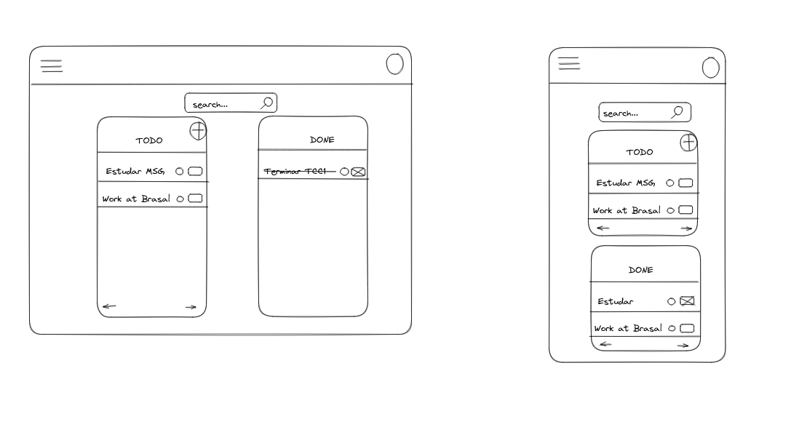

# To-Do FrontEnd

## How to run the project?

1. Clone it via ssh/https or download the project as a zip file and extract it.
2. Install dependencies

```npm install```

    Note: Node versions below 14 may present some errors while downloading the dependencies

3. Run the command to start the server

```npm run dev```

4. The application can be accessed at: localhost:3000

## Low Fidelity Prototype



### Customize Configuration

See [Configuration Reference](https://vitejs.dev/config/).
